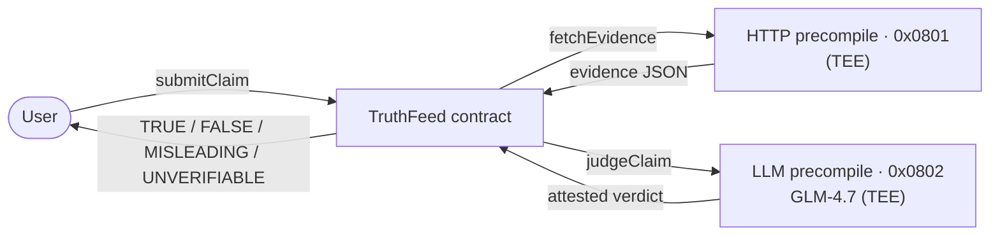

<div align="center">

# ⟡ TruthFeed

### The Machine Tribunal — an on-chain, TEE-attested fact-checker on Ritual Chain

*Submit a rumor, a headline, a "fact." The machine hunts real evidence, deliberates inside a sealed TEE, and carves its verdict onto the chain — permanently. Nobody can bribe it. Nobody can bury it.*


</div>

---

## What is this?

**TruthFeed** fact-checks a claim end-to-end **on-chain**. A claim is filed, real-world
evidence is pulled from a public source with Ritual's **HTTP precompile**, and a verdict
is rendered by the on-chain **LLM precompile** — both executed inside a **TEE (Trusted
Execution Environment)**. The evidence and the verdict are written to the chain, so the
judgment can't be silently forged, edited, or re-biased.

Every verdict is one of `TRUE` · `FALSE` · `MISLEADING` · `UNVERIFIABLE`, carrying a
confidence score, a one-line reasoning, the source it read, and its citations.

> **Not just another AI wrapper.** Unlike a trivia game or an "AI judge" that only weighs
> two arguments, TruthFeed fetches **external evidence** and produces a **verifiable,
> tamper-proof** verdict that lives on-chain.

---

## How it works



Both HTTP and LLM are **short-running async** precompiles: the transaction is deferred, a
TEE executor runs the work off-chain, and the signed result is injected back into the same
transaction. Only **one** async precompile is allowed per transaction, so evidence-fetching
and judging are two separate steps.

### Ritual primitives used

| Step | Primitive | Address |
| --- | --- | --- |
| Pull evidence from a public source | HTTP precompile | `0x…0801` |
| Judge the claim vs. the evidence | LLM precompile (GLM-4.7-FP8) | `0x…0802` |
| Escrow async executor fees | RitualWallet | `0x532F…3948` |
| Select a live TEE executor | TEEServiceRegistry | `0x9644…Bf47F` |

---

## Live deployment

| | |
| --- | --- |
| **Network** | Ritual Chain (chain id `1979`) |
| **Contract** | [`0x7357875a6aeb2d96551946e8a695224a9cca880f`](https://explorer.ritualfoundation.org/address/0x7357875a6aeb2d96551946e8a695224a9cca880f) |
| **RPC** | `https://rpc.ritualfoundation.org` |

Verified end-to-end on-chain, e.g. *"The Eiffel Tower is located in Berlin"* → **FALSE (100%)**,
*"Water boils at 100°C at sea level"* → **TRUE (100%)**.

---

## Tech stack

- **Contract** — Solidity `0.8.24`, compiled with `solc` (`viaIR`, shanghai EVM).
- **Chain layer** — [viem](https://viem.sh) for encoding precompile calls, deploying, and driving the pipeline.
- **Frontend** — a single, dependency-free page: an **EIP-6963** wallet adapter, live
  on-chain reads, and a cinematic **GSAP** verification pipeline — no build step, no framework runtime.

---

## Getting started

```bash
npm install

# 1. compile the contract  ->  build/TruthFeed.json
npm run compile

# 2. deploy to Ritual  (needs PRIVATE_KEY + testnet RITUAL in .env)
npm run deploy            # prints the address; put it in .env as TRUTHFEED_ADDRESS

# 3. fact-check a claim end-to-end from the CLI
node scripts/interact.mjs all "The Eiffel Tower is located in Berlin." "Eiffel Tower"

# 4. launch the UI
npm run web               # http://localhost:8787
```

Create a `.env` (git-ignored) from this template:

```bash
RITUAL_RPC_URL=https://rpc.ritualfoundation.org
CHAIN_ID=1979
PRIVATE_KEY=0x...            # testnet key only — faucet RITUAL, no real value
TRUTHFEED_ADDRESS=0x...      # filled in after deploy
```

Get testnet RITUAL from the [faucet](https://faucet.ritualfoundation.org).

### CLI reference

```bash
node scripts/interact.mjs deposit 0.4         # fund + lock RitualWallet for async fees
node scripts/interact.mjs submit "<claim>"    # file a claim
node scripts/interact.mjs fetch  <id> "<query>"   # HTTP precompile → evidence
node scripts/interact.mjs judge  <id>         # LLM precompile → verdict (auto-retries)
node scripts/interact.mjs read                # print the full docket
```

---

## Project structure

```
contracts/TruthFeed.sol   on-chain verifier — calls the HTTP + LLM precompiles
scripts/lib.mjs           chain config, ABIs, TEE executor selection (viem)
scripts/compile.mjs       solc compile (viaIR, shanghai) → build/TruthFeed.json
scripts/deploy.mjs        deploy + confirm on-chain code
scripts/interact.mjs      submit → fetch → judge → read pipeline
scripts/serve.mjs         static server + /config.json for the frontend
web/index.html            the Machine Tribunal UI (wallet adapter + GSAP pipeline)
Design/                   original design source (Claude Design / dc-runtime)
```

---

## Engineering notes (real Ritual constraints)

- **RitualWallet needs an active _lock_, not just a balance.** Async calls are rejected
  with `insufficient lock duration` if `lockUntil` has passed — funds present or not. The
  deposit helper re-extends the lock on every run.
- **One async precompile per transaction** → evidence-fetch and judging are two txs.
- **Sender lock** — one pending async job per account; the pipeline runs sequentially.
- **HTTP responses cap at ~5KB** → the Wikipedia search uses `limit=1`, and a `User-Agent`
  header is passed through the contract.
- **`viaIR` compilation** is required (stack-too-deep), targeting the **shanghai** EVM.
- **Single testnet LLM executor** can be flaky, so judging **auto-retries** with a raised TTL.

---

## Roadmap

- Multi-source evidence via ECIES-encrypted news-API secrets (beyond keyless Wikipedia).
- `Scheduler` (`0x56e7…D58B`) to re-check time-sensitive claims and update verdicts.
- Fully on-chain, queryable verdict struct via the JQ precompile (`0x0803`).

---

<div align="center">
<sub>The verdict is not an opinion. It is a record. — carved on-chain, block after block.</sub>
</div>
